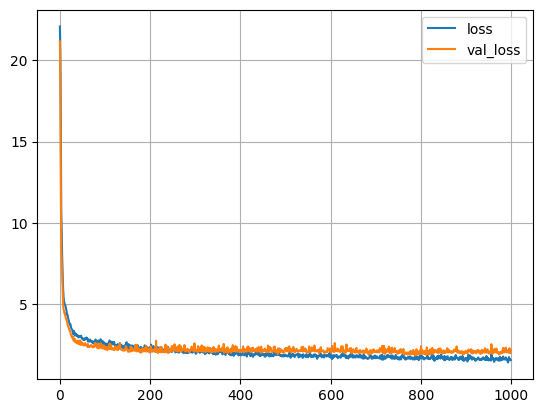

# Boston_house_Pricing_ANN
I created this repository to document my work on predicting house prices in Boston using an Artificial Neural Network (ANN). I used the well-known Boston housing dataset, which consisted of features such as crime rate, number of rooms, age of the building, and other relevant variables. My goal was to build and train a neural network model that could estimate house prices accurately.

## Project Overview ##
- Objective: I aimed to apply an ANN to predict house prices in Boston.
- Dataset: I worked with the Boston housing dataset, which I imported from the sklearn.datasets module.
- Approach: I split the dataset into training and testing subsets, scaled the features, and constructed a neural network to learn the relationship between the input features and house prices. I used Keras (with a TensorFlow backend) for building, training, and evaluating the model.

## Features of the Project
###  Data Preprocessing ###
- I handled the dataset by cleaning and normalizing the features.
- I used train_test_split to divide the data into training and testing sets.
- I applied feature scaling (StandardScaler) to achieve faster convergence during model training.

### Model Architecture ###
- I constructed a feedforward neural network using the Keras Sequential API.
- I experimented with various hyperparameters, including the number of hidden layers, number of neurons, and activation functions.
- I added dropout layers in some configurations to prevent overfitting.

### Model Training ###
- I compiled the model using Mean Squared Error (MSE) as the loss function and the Adam optimizer for gradient-based optimization.
- I trained the model over multiple epochs, tracked the training and validation losses, and applied early stopping techniques in some trials to prevent overfitting.
 ```
model_history = model.fit(x = x_train, y = y_train, validation_data = (x_val, y_val), batch_size= 32, epochs=1000)
 ```
### Evaluation ###
- I evaluated the performance of the trained model on the testing set using metrics such as Mean Squared Error (MSE) and Mean Absolute Error (MAE).
- I plotted learning curves to visualize how the model’s accuracy and loss changed over epochs.
```
test_score = model.evaluate(x_test, y_test)
```
## Requirements
I used the following libraries and tools to set up my environment:
- Python, - NumPy, - Pandas, - Scikit-learn-TensorFlow (or Keras), - Matplotlib (for data visualization)
- I installed them using pip install -r requirements.txt (if a requirements file was included).

## Results

#### Train Loss ####
 - loss: 1.5737  
#### Validation Loss ####
 - val_loss: 2.1633

1.  I observed that the neural network model was able to predict Boston house prices fairly accurately.
2.  I experimented with different model configurations and found that deeper networks sometimes improved performance, but also required careful regularization and tuning.
3.  The Mean Absolute Error on the test set consistently decreased as I refined the network, though performance gains began to plateau after certain modifications.
4.  The Coefficient of determination (r2 score) had a value of 0.8201
 
## License
I placed this project under the MIT License. Feel free to use or modify the code according to the license terms.


Thank you for checking out my Boston House Pricing with ANN project. I wrote this project to document my learning and experimentation with neural networks for regression tasks. I hope it proves useful for anyone interested in exploring deep learning for housing price predictions. Feel free to open an issue or submit a pull request if you have suggestions or improvements!